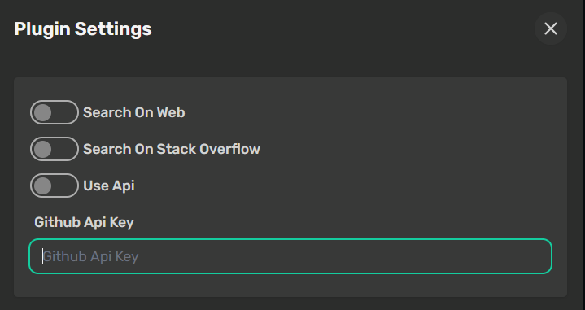

# Cat 0verf10w

  

Let the Cat become your coding assistant by learning everything about your favourite libraries!

## Current Features

* Search Github without github api key (faster ingestion) **this is recommended way**
* Search Github with github api key (slower ingestion)
* Fallback to raw github url if mime type is unsupported

## Todo

* Search in google
* Search in stackoverflow answers with the same "category"

## How to use

`@getcode ...` is the trigger for the tool

### General search

passing a library name will search that inside github

syntax:

`@getcode "library name or term"`

example:

`@getcode cheshire_cat`

will search on github and show some of the matching repositories found

### Exact search

passing owner and repository name separated by backslash will try to find that. If an exact match (only one) is found, then the download will start automatically

syntax:

`@getcode "owner"/"repository name"`

will start download the library if only one result is matched

examples:

`@getcode cheshire-cat-ai/docs`

will try to find a repository. If only one result is found, it start downloading repo automatically. After download every file inside the archive is ingested with rabbit-hole.

> **Important**
>
>if a mime type is unsupported by rabbit hole this plugin will try to use the 
>corresponding raw github raw file url to ingest the content anyway

## Settings

* Search on Web (TODO) - not available at the moment
* Search on StackOverflow (TODO) - not available at the moment
* Use Github API - this must be activated to use "Github API token" during searches
* Github API token - your github API token ([how to create a classic token](https://docs.github.com/en/authentication/keeping-your-account-and-data-secure/managing-your-personal-access-tokens))

